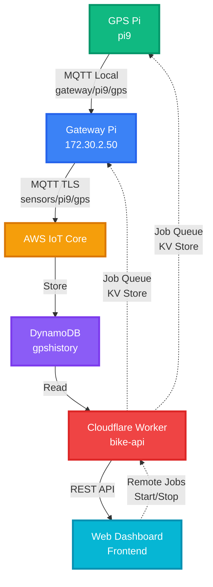

# 🚴 Bike Tracker IoT System

> A complete IoT bike tracking system with **real-time GPS monitoring**, **theft detection**, and **remote job execution**. Built with Cloudflare Workers, Raspberry Pi, and AWS IoT Core.

<div align="center">


[Features](#-features) • [Architecture](#-system-architecture) • [Quick Start](#-quick-start) • [API Docs](#-api-documentation) • [Troubleshooting](#-troubleshooting)

</div>

---

## ✨ Features

### 🗺️ Real-time GPS Tracking
- **Live position updates** on interactive Leaflet map with satellite/street view
- **Historical track** with polyline visualization (last 500 points)
- **Auto-refresh** every 3 seconds with visual countdown indicator
- **Dynamic status badge** with color-coded states (online, offline, no GPS fix, stolen)

### 🔒 Theft Detection & Alerts
- Mark bike as **stolen** with PIN protection
- Visual alerts with **red banner** and animated map marker
- Track stolen bike location in real-time
- **Color-coded track**: Blue (normal) / Red (stolen mode)

### 🎛️ Remote System Control
- **One-click system startup**: Start GPS Reader + MQTT Forwarder
- **One-click system shutdown**: Stop all components remotely
- **Comprehensive error handling** with 30s/20s timeouts
- **Real-time status messages** with progress indicators
- **Conditional UI**: Show Start OR Stop button based on system state

### 🌐 Modern Web Dashboard
- **Responsive design** with Tailwind CSS and glassmorphism effects
- **Live status indicators**: Pulsing ring for fresh updates
- **System Messages panel** with color-coded alerts (success/warning/error)
- **Separate timestamps**: "Last update" vs "Last GPS fix"
- **Speed & course display** with real-time updates

### 🔄 Distributed Architecture
- **Decoupled components** for scalability
- **Job queue system** with polling architecture
- **MQTT bridge** forwarding data from local broker to AWS IoT Core
- **Rate limiting**: 1 message/10s per topic

---

## 🏗️ System Architecture



### Data Flow

```
GPS Pi → MQTT (gateway/pi9/gps)
    → Gateway Pi → AWS IoT (sensors/pi9/gps)
    → DynamoDB → Backend API → Frontend Map
```

---

## 📂 Project Structure

```
.
├── 📦 backend/              # Cloudflare Worker backend
│   ├── worker.js            # API endpoints (GPS, jobs, status, track)
│   └── wrangler.toml        # Cloudflare configuration
│
├── 🌐 frontend/             # Web dashboard (Tailwind CSS)
│   ├── index.html           # Modern UI with glassmorphism
│   ├── app.js               # Application logic with error handling
│   └── config.js            # Configuration (API URL, intervals, targets)
│
├── 🔷 gateway/              # Gateway Pi code
│   ├── job_poller.py        # Job polling daemon (PI_ID: gateway)
│   ├── mqtt_forwarder.py    # MQTT → AWS IoT bridge
│   ├── setup_service.sh     # Automated systemd setup
│   ├── requirements.txt     # Python dependencies
│   └── README.md            # Gateway documentation
│
└── 🟢 gps_pi/               # GPS Pi code
    ├── job_poller.py        # Job polling daemon (PI_ID: pi9)
    ├── mqtt_gps_reader.py   # GPS MQTT publisher
    ├── setup_service.sh     # Automated systemd setup
    ├── requirements.txt     # Python dependencies
    └── README.md            # GPS Pi documentation
```

---

## 🚀 Quick Start

### 1️⃣ Backend Deployment (Cloudflare Workers)

```bash
cd backend
npm install -g wrangler

# Login to Cloudflare
wrangler login

# Create KV namespaces
wrangler kv:namespace create BIKE_STATUS
wrangler kv:namespace create JOB_QUEUE

# Update wrangler.toml with KV namespace IDs

# Deploy
wrangler deploy

# Set secrets
wrangler secret put AWS_ACCESS_KEY
wrangler secret put AWS_SECRET_KEY
wrangler secret put ADMIN_PIN
```

### 2️⃣ Frontend Deployment

```bash
cd frontend

# Update config.js with your Worker URL
# Deploy to any static hosting (Cloudflare Pages, Netlify, Vercel, etc.)
```

### 3️⃣ GPS Pi Setup

```bash
# Copy files to GPS Pi
scp -r gps_pi pi@<gps-pi-ip>:~/

# SSH to GPS Pi
ssh pi@<gps-pi-ip>
cd ~/gps_pi

# Install dependencies
pip3 install -r requirements.txt

# Run automated setup (creates systemd service)
chmod +x setup_service.sh
./setup_service.sh

# Verify service is running
sudo systemctl status gps-poller
```

### 4️⃣ Gateway Pi Setup

```bash
# Copy files to Gateway Pi
scp -r gateway pi@172.30.2.50:~/

# SSH to Gateway Pi
ssh pi@172.30.2.50
cd ~/gateway

# Install dependencies
pip3 install -r requirements.txt

# Run automated setup (creates systemd service)
chmod +x setup_service.sh
./setup_service.sh

# Verify service is running
sudo systemctl status gateway-poller
```

### 5️⃣ Start System via Web UI

1. Open frontend in browser
2. Click **"▶ Start System"** button
3. Wait for status: **"✓ System running (GPS + MQTT)"**
4. GPS data should now flow to the map! 🎉

---

## 📡 API Documentation

### Backend Endpoints

#### 🗺️ GPS Position

**GET `/api/position?device=<device_id>`**
- Returns current GPS position with timestamps
- Response:
```json
{
  "lat": 47.049123,
  "lon": 8.305456,
  "ts": 1733145659000,
  "last_update_ts": 1733145659000,
  "speed": 2.5,
  "course": 180.0,
  "stolen": false
}
```

**POST `/api/position`**
- Update GPS position (called by MQTT forwarder)
- Body: `{ device_id, lat, lon, timestamp, speed?, course? }`

#### 🔐 Theft Status

**GET `/api/status?device=<device_id>`**
- Returns current theft status
- Response: `{ stolen: boolean }`

**POST `/api/stolen`**
- Update theft status (requires PIN)
- Body: `{ stolen: boolean, pin: string, device: string }`

#### 📜 Historical Track

**GET `/api/track?device=<device_id>&limit=<n>`**
- Returns GPS history from DynamoDB
- Default limit: 100, max: 1000
- Response: `[{ lat, lon, ts, speed, course, stolen }, ...]`

#### 🎯 Job Queue

**POST `/api/job`**
- Create a new remote job
- Body:
```json
{
  "type": "start_gps_reader" | "stop_gps_reader" | "mqtt_forward" | "stop_mqtt_forward",
  "target": "pi9" | "gateway",
  "params": {}
}
```
- Response: `{ job_id: "uuid" }`

**GET `/api/job/poll?pi_id=<id>`**
- Gateway polls for pending jobs (called every 5s)
- Response: `{ job: { id, type, params, ... } | null }`

**POST `/api/job/result`**
- Report job completion (called by device)
- Body: `{ job_id, status: "done" | "failed" | "timeout", output, duration_ms }`

**GET `/api/job/status?job_id=<id>`**
- Check job execution status (called by frontend)
- Response: `{ job: { id, status, output, ... } }`

---

## 🎮 Supported Job Types

### `start_gps_reader`
**Target:** `pi9` (GPS Pi)
**Timeout:** 30s

Starts GPS reader that publishes NMEA data to MQTT.

```json
{
  "type": "start_gps_reader",
  "target": "pi9",
  "params": { "device": "pi9" }
}
```

**What it does:**
- Starts `mqtt_gps_reader.py` in background
- Reads GPS from `/dev/ttyS0` (115200 baud)
- Publishes to MQTT topic `gateway/pi9/gps`

---

### `stop_gps_reader`
**Target:** `pi9` (GPS Pi)
**Timeout:** 20s

Stops the GPS reader process.

```json
{
  "type": "stop_gps_reader",
  "target": "pi9",
  "params": {}
}
```

**What it does:**
- Finds and kills `mqtt_gps_reader.py` process
- Graceful shutdown with `pkill -f`

---

### `mqtt_forward`
**Target:** `gateway` (Gateway Pi)
**Timeout:** 30s

Starts MQTT bridge to AWS IoT Core.

```json
{
  "type": "mqtt_forward",
  "target": "gateway",
  "params": { "script_path": "mqtt_forwarder.py" }
}
```

**What it does:**
- Starts `mqtt_forwarder.py` in background
- Subscribes to `gateway/#` on local broker (port 1883)
- Forwards to AWS IoT as `sensors/#` (port 8883, TLS)
- Rate limits to 1 msg/10s per topic

---

### `stop_mqtt_forward`
**Target:** `gateway` (Gateway Pi)
**Timeout:** 20s

Stops the MQTT forwarder process.

```json
{
  "type": "stop_mqtt_forward",
  "target": "gateway",
  "params": {}
}
```

**What it does:**
- Finds and kills `mqtt_forwarder.py` process
- Graceful shutdown with `pkill -f`

---

## ⚙️ Configuration

### Backend (`backend/wrangler.toml`)

```toml
name = "bike-api"

[vars]
AWS_REGION = "eu-central-1"
DYNAMODB_TABLE = "gpshistory"

kv_namespaces = [
  { binding = "BIKE_STATUS", id = "your-kv-id" },
  { binding = "JOB_QUEUE", id = "your-kv-id" }
]
```

### Frontend (`frontend/config.js`)

```javascript
const CONFIG = {
  API_URL: 'https://bike-api.your-account.workers.dev',
  DEVICE_ID: 'pi9',
  UPDATE_INTERVAL: 3000,           // GPS refresh interval (ms)
  JOB_STATUS_POLL_MS: 2000,        // Job polling interval (ms)
  STALE_UPDATE_MS: 60000,          // Max age for "online" status
  STALE_FIX_MS: 120000,            // Max age for valid GPS fix
  GATEWAY_TARGET: 'gateway',
  GPS_PI_TARGET: 'pi9'
};
```

---

## 🛠️ Development

### Running Locally

**Backend:**
```bash
cd backend
wrangler dev --port 8787
```

**Frontend:**
```bash
cd frontend
python -m http.server 8000
# Open http://localhost:8000
```

**Gateway (simulation):**
```bash
cd gateway
python3 job_poller.py
```

### Testing Jobs

```bash
# Create a test job
curl -X POST http://localhost:8787/api/job \
  -H "Content-Type: application/json" \
  -d '{
    "type": "start_gps_reader",
    "target": "pi9",
    "params": {"device": "pi9"}
  }'

# Check job status
curl "http://localhost:8787/api/job/status?job_id=<job_id>"
```

---

## 🔧 Troubleshooting

### 🔴 Backend Issues

**Worker not responding:**
```bash
# Check logs
wrangler tail

# Verify KV namespaces
wrangler kv:namespace list

# Test endpoint
curl https://bike-api.your-account.workers.dev/api/position
```

---

### 🟢 GPS Pi Issues

**Job poller not receiving jobs:**
```bash
# Check service status
sudo systemctl status gps-poller

# Check logs
sudo journalctl -u gps-poller -f

# Test API connectivity
curl "https://bike-api.dyntech.workers.dev/api/job/poll?pi_id=pi9"
```

**GPS not reading:**
```bash
# Check GPS module (should show NMEA sentences)
cat /dev/ttyS0
# Example: $GNRMC,123519,A,4807.038,N,01131.000,E,022.4,084.4,230394,003.1,W*6A

# Check if GPS has fix (needs open sky view!)
# Fix indicator in NMEA: $GNRMC,...,A,... (A = valid, V = invalid)
```

**GPS Reader fails with "timeout after 30s":**
- Check GPS Pi is powered on and network-connected
- Verify job poller is running: `sudo systemctl status gps-poller`
- Check GPS module is connected to `/dev/ttyS0`
- Ensure script path is correct: `ls -la ~/gps_pi/mqtt_gps_reader.py`

---

### 🔷 Gateway Pi Issues

**MQTT forwarder fails:**
```bash
# Verify certificates exist
ls -l /etc/mosquitto/certs/
# Should show: root-CA.crt, iot_gateway.cert.pem, iot_gateway.private.key

# Test local MQTT broker
mosquitto_sub -h 127.0.0.1 -t "gateway/#"
# Should show messages from GPS Pi

# Test AWS IoT connection
openssl s_client -connect <your-endpoint>.iot.eu-central-1.amazonaws.com:8883 \
  -cert /etc/mosquitto/certs/iot_gateway.cert.pem \
  -key /etc/mosquitto/certs/iot_gateway.private.key
```

**Gateway fails with "timeout after 30s":**
- Check Gateway Pi is powered on and network-connected
- Verify job poller is running: `sudo systemctl status gateway-poller`
- Check MQTT forwarder script exists: `ls -la ~/gateway/mqtt_forwarder.py`
- Verify AWS IoT certificates are present in `/etc/mosquitto/certs/`

---

### 🌐 Frontend Issues

**Status badge stuck on "Connecting...":**
- Check backend API is reachable: `curl <API_URL>/api/position`
- Verify `API_URL` in `config.js` is correct
- Check browser console (F12) for CORS or network errors

**"Start System" button shows error:**
- Verify both pollers are running on the devices
- Check timeout messages in System Messages panel
- Common errors:
  - `"GPS Pi unreachable (timeout after 30s)"` → GPS Pi offline or job poller not running
  - `"Gateway unreachable (timeout after 30s)"` → Gateway Pi offline or job poller not running
  - `"GPS Reader failed: ..."` → Check GPS Pi logs: `sudo journalctl -u gps-poller -f`

**Map shows "No GPS fix available":**
- GPS has connection but no valid coordinates (orange badge)
- Check GPS module has clear sky view (takes 30-60s for cold start)
- Verify GPS fix indicator in NMEA: `$GNRMC,...,A,...` (A = valid)

**Map shows "Offline" but system is running:**
- Last signal is older than 60 seconds (orange badge)
- Check GPS Pi is publishing to MQTT: `mosquitto_sub -h 127.30.2.50 -t "gateway/#"`
- Check MQTT forwarder is running on Gateway Pi
- Verify DynamoDB has recent entries

---

## 📊 Performance

- **Backend Latency**: ~50-100ms (Cloudflare Workers global network)
- **Job Polling**: 5 seconds interval (configurable in `job_poller.py`)
- **GPS Updates**: 3 seconds interval (configurable in `config.js`)
- **MQTT Rate Limit**: 1 message/10 seconds per topic
- **Job Timeout**: 30s (start operations), 20s (stop operations)
- **Max Track Points**: 500 (configurable in `config.js`)

---

## 🔒 Security

- ✅ **TLS Encryption**: All HTTPS communication
- ✅ **X.509 Certificates**: AWS IoT Core mutual TLS authentication
- ✅ **Admin PIN**: Required for theft status updates
- ✅ **Rate Limiting**: MQTT message throttling (1/10s per topic)
- ✅ **Input Validation**: All API endpoints validate inputs
- ✅ **CORS**: Configured for frontend domain only
- ✅ **Secrets Management**: Environment variables via Cloudflare Secrets

---

## 🎨 UI Features

### Dynamic Status Badge
- 🟢 **Green**: System online, fresh GPS data
- 🟠 **Orange**: Offline or signal too old
- 🔵 **Blue**: Connection but no GPS fix
- 🔴 **Red**: Bike reported as stolen
- 🟣 **Indigo**: Connecting (initial state)

### System Messages Panel
- **Success** (green): "✓ System running (GPS + MQTT)"
- **Warning** (amber): "GPS Reader starting... (timeout: 30s)"
- **Error** (red): "GPS Pi unreachable (timeout after 30s)"
- **Muted** (gray): "System idle"

### Visual Indicators
- **Pulsing ring**: Appears around status dot when truly live
- **Update countdown**: Circular progress showing next refresh
- **Conditional buttons**: Show Start OR Stop based on system state

---

## 📦 Hardware Requirements

### GPS Pi (pi9)
- Raspberry Pi Zero W or similar
- GPS module (UART/Serial connected to `/dev/ttyS0`, 115200 baud)
- Python 3.7+
- Network connection to Gateway Pi (MQTT)
- **Role**: Read GPS, publish to MQTT

### Gateway Pi (172.30.2.50)
- Raspberry Pi (any model with network)
- Python 3.7+
- Network connection (LAN/WLAN)
- MQTT broker (Mosquitto) running locally on port 1883
- AWS IoT certificates in `/etc/mosquitto/certs/`
- **Role**: MQTT bridge to AWS IoT Core

---

## 🤝 Contributing

1. Fork the repository
2. Create a feature branch (`git checkout -b feature/amazing-feature`)
3. Commit your changes (`git commit -m 'Add amazing feature'`)
4. Push to the branch (`git push origin feature/amazing-feature`)
5. Open a Pull Request

---

## 📄 License

This project is part of an IoT course at **HSLU (Hochschule Luzern)** – IoT Module HS25.

---

## 🙏 Acknowledgments

- [Cloudflare Workers](https://workers.cloudflare.com/) – Serverless backend platform
- [Leaflet.js](https://leafletjs.com/) – Interactive map visualization
- [Tailwind CSS](https://tailwindcss.com/) – Modern UI framework
- [paho-mqtt](https://www.eclipse.org/paho/) – Python MQTT client
- [AWS IoT Core](https://aws.amazon.com/iot-core/) – Cloud MQTT broker & routing
- [OpenStreetMap](https://www.openstreetmap.org/) – Free map tiles

---

## 📬 Contact

**Project Link:** [https://github.com/gurkepunktli/hslu_iot](https://github.com/gurkepunktli/hslu_iot)

---

<div align="center">

**Built with ❤️ for IoT @ HSLU HS25**

🚴 🗺️ 🔒

</div>
